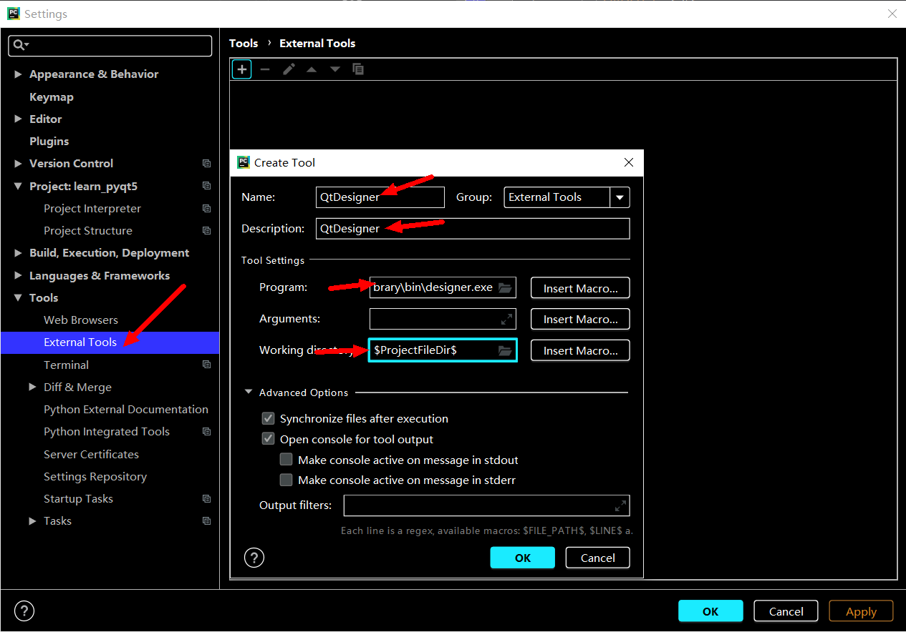

# 一、PyQt5程序基本结构分析
## 1.qt-designer配置与使用
### ①.pycharm中配置qt-designer工具
- 按下图所示配置pycharm，其中工作目录建议配置成：```$ProjectFileDir$```  

- 创建一个Main窗口并了解相关部件

### ②.将ui文件转换为py文件
- 方法一：使用命令行```python -m PyQt5.uic.pyuic demo.ui -o demo.py```
- 方法二：```pyuic5 demo.ui -o demo.py```
- 方法三：仿照#2添加pyuic工具，参数配置如下：  
 program：选择```python.exe```  
 arguments:```-m PyQt5.uic.pyuic $FileName$ -o $FileNameWithoutExtension$.py```  
 Working dir:```$FileDir$```

### ③.使用qt-designer运行窗口
```python
import sys
from  PyQt5.QtWidgets import QApplication, QMainWindow
# 引用生成的ui -> py 文件
import TestMainWindow

if __name__ == '__main__':
    app = QApplication(sys.argv)
    mainWindow = QMainWindow()
    # 引用ui -> py 文件里的类
    ui = TestMainWindow.Ui_MainWindow()
    # 调用类里的setupUi函数，在mainWindow上建立Ui
    ui.setupUi(mainWindow)
    mainWindow.show()
    sys.exit(app.exec_())
```
## 2.开发第一个Pyqt5的桌面应用

- 必须使用的两个类：QApplication and QWidget，二者均在pyqt5.qtwidgets
```python
from PyQt5.Qt import *
import sys

# 创建QApplication实例,argv为了将命令行参数传入
app = QApplication(sys.argv)

# 控件：创建控件、设置控件、展示控件
# 创建窗口
window = QWidget()
# 设置窗口标题
window.setWindowTitle('The First Window')
# 设置窗口尺寸
window.resize(200,200)
# 移动窗口
window.move(300,300)

# 创建lable标签，并且将window做为父控件
lable = QLabel(window)
lable.setText('Lable')
lable.move(100,100)

# 显示窗口(一个控件如果没有父控件，默认不被展示，必须使用show进行调用)
# 若控件有父控件，当父控件展示时将被一同展示
window.show()
# 进入程序主循环，并通过exit确保主循环安全结束，鉴证错误码
sys.exit(app.exec_())
```
## 3.在pycharm中设置活动模板
- 打开``` File -> Settings -> Search ‘live templates’```，如下图所示  
  
代码如下：
```python
from PyQt5.Qt import *
import sys

app = QApplication(sys.argv)

window = QWidget()

window.setWindowTitle("$TITLE$")
window.resize(500,500)

$CODE$

window.show()

sys.exit(app.exec_())
```
## 4.实现第一个类
```python
from PyQt5.Qt import *
import sys

# 继承QWidget类
class Window(QWidget):
    def __init__(self):
        # 在子类里调用父类的方法，防止父类的方法都不运行
        super().__init__()
        # 将原来的代码封装到这个类中
        # 原本是window. 但是由于window也是自己创建的，所以使用self.:调用自己
        self.setWindowTitle("实现第一个类")
        self.resize(500, 500)
        self.setup_label()

    def setup_label(self):
        label = QLabel(self)
        label.setText('xxx')

app = QApplication(sys.argv)
window = Window()
window.show()
sys.exit(app.exec_())
```
- 与此同时，可以将引用包和class放入一个新的py文件中。届时用```from .py import class```即可使用。
- 当类文件里除了class外的代码不想被执行时，其他代码可以添加到```if __name__ == '__main__':```中。
- 拓展：还可以将类保存到活动模板，以后方便创建及调测


# 二、PyQt5控件学习


